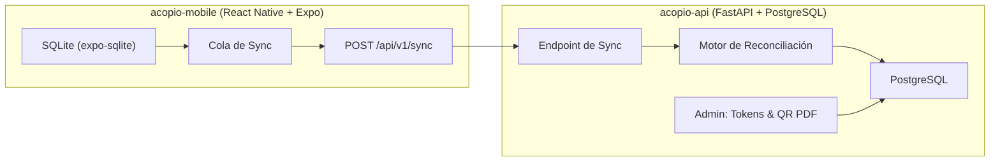
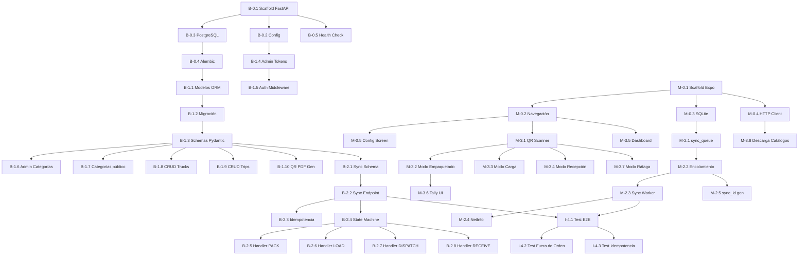

# Plan de Implementación: Sistema Logístico LPN "Acopio"

Plan de trabajo desglosado para el MVP del sistema de trazabilidad de insumos con patrón Offline-First. El desglose está organizado en **4 fases secuenciales**, cada una con tareas atómicas y ejecutables, priorizando la entrega incremental de valor.

---

## Arquitectura General

---

## Decisiones Confirmadas

| Decisión | Resolución |
|----------|------------|
| **Endpoint de Sync** | Un solo endpoint `POST /api/v1/sync` con Bulk Sync para simplicidad y robustez offline-first. |
| **Autenticación** | Tokens estáticos por centro de acopio via header `X-Camp-Token`. Se gestionan mediante **endpoints de admin** en la API. |
| **Generación de QR** | La API incluye un **script/endpoint que genera un PDF con códigos QR**. El UUID del QR se registra en la BD cuando la caja se embala con todos los items (no se pre-registra como `PRE_PRINTED`). |
| **Base de datos móvil** | **SQLite puro** con `expo-sqlite`. Más ligero y suficiente para implementar la cola de sync manualmente. |
| **Categorías** | Vienen **pre-cargadas con datos semilla** en la migración inicial (Alimentos, Medicinas, Ropa, Higiene, Herramientas, etc.). El admin puede gestionarlas via API. |
| **Tally (Conteo rápido)** | Formulario **sencillo**: selección de categoría + cantidad. Sin fotos ni notas adicionales. |

---

## Fase 0 — Infraestructura y Scaffolding (Ambos repos)

### Backend (`acopio-api`)

| #   | Tarea | Descripción | Entregable |
|-----|-------|-------------|------------|
| B-0.1 | **Scaffold del proyecto FastAPI** | Crear estructura de carpetas: `app/`, `app/models/`, `app/schemas/`, `app/api/`, `app/core/`, `app/db/`. Configurar `pyproject.toml` con dependencias (fastapi, uvicorn, sqlalchemy, asyncpg, alembic, pydantic, reportlab). | Proyecto ejecutable con `uvicorn app.main:app` |
| B-0.2 | **Configuración de entorno** | Crear `app/core/config.py` con Pydantic Settings para variables de entorno (`DATABASE_URL`, `ADMIN_SECRET`, `DEBUG`). Crear `.env.example`. | Configuración centralizada |
| B-0.3 | **Conexión a PostgreSQL** | Configurar SQLAlchemy async engine + session factory en `app/db/session.py`. Crear `app/db/base.py` para modelos declarativos. | Conexión funcional a la BD |
| B-0.4 | **Setup de Alembic** | Inicializar Alembic para migraciones. Configurar `alembic.ini` y `env.py` para usar el mismo engine async. | `alembic upgrade head` funcional |
| B-0.5 | **Endpoint de health check** | `GET /api/v1/health` que responda `{"status": "ok", "timestamp": "..."}`. Útil para verificar conectividad desde la app. | Primer endpoint funcional |
| B-0.6 | **Dockerización básica** | `Dockerfile` para la API + `docker-compose.yml` con servicio `api` y `db` (PostgreSQL). | `docker compose up` levanta todo |

---

### App Móvil (`acopio-mobile`)

| #   | Tarea | Descripción | Entregable |
|-----|-------|-------------|------------|
| M-0.1 | **Scaffold Expo + TypeScript** | `npx create-expo-app` con template TypeScript. Configurar estructura: `src/`, `src/screens/`, `src/components/`, `src/db/`, `src/services/`, `src/hooks/`. | App ejecutable con `npx expo start` |
| M-0.2 | **Configuración de navegación** | Instalar `expo-router`. Definir las rutas base: Configuración → Home → Escáner → Detalle Paquete. | Navegación funcional entre pantallas |
| M-0.3 | **Setup de SQLite local** | Instalar y configurar `expo-sqlite`. Crear esquema local: `package`, `package_item`, `sync_queue`. Funciones de inicialización de tablas al primer arranque. | BD SQLite local funcional con tablas creadas |
| M-0.4 | **Servicio HTTP base** | Crear `src/services/api.ts` con fetch configurado: base URL, header `X-Camp-Token`, timeout, manejo de errores. | Cliente HTTP listo para consumir la API |
| M-0.5 | **Pantalla de configuración inicial** | Screen para ingresar: URL del servidor + Token del centro de acopio. Guardar en `expo-secure-store`. | App configurable sin hardcodear valores |

---

## Fase 1 — Modelo de Datos, Admin y CRUD Base (Backend-first)

### Backend (`acopio-api`)

| #   | Tarea | Descripción | Entregable |
|-----|-------|-------------|------------|
| B-1.1 | **Modelos SQLAlchemy** | Crear los modelos ORM en `app/models/`: `Truck`, `Trip`, `Package`, `Category`, `PackageItem`, `CampToken`, `SyncLog`. Mapear el DDL de la doc V4 con relaciones y constraints. Agregar modelo `CampToken` (id, token_hash, camp_name, is_active, created_at). | Modelos ORM completos |
| B-1.2 | **Migración inicial** | Generar migración de Alembic que cree todas las tablas. Incluir datos semilla para `category` (Alimentos, Medicinas, Ropa, Higiene, Herramientas). | `alembic upgrade head` crea tablas y categorías semilla |
| B-1.3 | **Schemas Pydantic — Entidades base** | Crear schemas en `app/schemas/`: `TruckCreate/Response`, `TripCreate/Response`, `PackageResponse`, `CategoryResponse`, `PackageItemCreate`, `CampTokenCreate/Response`. | Validación de entrada/salida definida |
| B-1.4 | **Endpoints de Admin — Gestión de Tokens** | Endpoints protegidos con `ADMIN_SECRET` (header `X-Admin-Secret`): `POST /api/v1/admin/tokens` (crear token para un centro), `GET /api/v1/admin/tokens` (listar), `DELETE /api/v1/admin/tokens/{id}` (revocar). El token se genera automáticamente (UUID) y se retorna una sola vez al crearlo. | CRUD de tokens de centro operativo |
| B-1.5 | **Middleware de autenticación por token de centro** | Crear dependency en `app/core/security.py` que extraiga el header `X-Camp-Token`, lo busque en la tabla `camp_token`, verifique que esté activo y rechace con `403` si es inválido. Inyectar el `camp_name` en el contexto de la request. | Seguridad por token dinámico funcional |
| B-1.6 | **Endpoints de Admin — Gestión de Categorías** | `POST /api/v1/admin/categories` (crear), `PUT /api/v1/admin/categories/{id}` (editar), `DELETE /api/v1/admin/categories/{id}` (eliminar). Protegidos con `X-Admin-Secret`. | Admin puede gestionar catálogo |
| B-1.7 | **Endpoint público de Categorías** | `GET /api/v1/categories` (protegido con `X-Camp-Token`) para que la app descargue el catálogo. | Catálogo disponible para la app |
| B-1.8 | **CRUD de Camiones** | Endpoints REST: `POST /api/v1/trucks` (registrar), `GET /api/v1/trucks` (listar), `GET /api/v1/trucks/{id}` (detalle). Protegidos con `X-Camp-Token`. | CRUD de camiones operativo |
| B-1.9 | **CRUD de Viajes** | Endpoints: `POST /api/v1/trips` (crear manifiesto vinculado a un camión), `GET /api/v1/trips` (listar con filtro por status), `GET /api/v1/trips/{id}` (detalle con paquetes). | CRUD de viajes operativo |
| B-1.10 | **Script/Endpoint de generación de QR en PDF** | Endpoint `POST /api/v1/admin/qr/generate` que reciba la cantidad de etiquetas deseadas, genere UUIDs, y retorne un PDF descargable con los códigos QR listos para imprimir (usando `reportlab` + `qrcode`). Los UUIDs **NO** se registran en la BD en este momento; se registran cuando la caja se embala (evento `PACK`). | PDF de QRs generables bajo demanda |

---

## Fase 2 — Motor de Sincronización (Corazón del sistema)

### Backend (`acopio-api`) — Endpoint de Sync

| #   | Tarea | Descripción | Entregable |
|-----|-------|-------------|------------|
| B-2.1 | **Schema del Sync Payload** | Definir `SyncRequest` Pydantic: lista de `SyncEvent` con campos `sync_id` (UUID), `event_type` (enum: `PACK`, `LOAD_TO_TRIP`, `DISPATCH`, `RECEIVE`), `device_timestamp`, `payload` (datos específicos del evento). | Contrato de API para sync definido |
| B-2.2 | **Endpoint POST /api/v1/sync** | Crear el endpoint que reciba el `SyncRequest`, itere los eventos y delegue al motor de reconciliación. Responder con resultado por evento: `{sync_id, status: "applied" | "duplicate" | "conflict", detail}`. | Endpoint de sync funcional |
| B-2.3 | **Idempotencia con sync_id** | Usar tabla `sync_log` (sync_id UUID PK, event_type, processed_at, result). Antes de procesar un evento, verificar si `sync_id` ya existe → retornar `"duplicate"`. | Protección contra duplicados |
| B-2.4 | **Máquina de estados centralizada** | Crear `app/core/state_machine.py` con función `can_transition(current, target) -> bool` y mapa de transiciones válidas. Todos los handlers la usan. Estados: `PACKED`, `SHIPPED_EMPTY`, `IN_TRANSIT`, `DELIVERED`, `RECEIVED_UNVERIFIED`. | Transiciones de estado validadas centralmente |
| B-2.5 | **Handler: evento PACK** | Procesar empaquetado: crear registro de paquete con UUID del QR + insertar `package_items` → estado `PACKED`. Si el paquete ya existe como `SHIPPED_EMPTY` → `PACKED` + resolver. Si es `RECEIVED_UNVERIFIED` → `DELIVERED` (resolución retroactiva). Si el UUID es nuevo → crear paquete + items. | Lógica de empaquetado con reconciliación |
| B-2.6 | **Handler: evento LOAD_TO_TRIP** | Vincular paquete a un `trip_id`. Si estado es `PACKED` → asignar `trip_id`. Si el paquete no existe aún en la BD (caja embalada offline, sync pendiente) → crear registro con estado `SHIPPED_EMPTY`. | Lógica de carga con estado defensivo |
| B-2.7 | **Handler: evento DISPATCH** | Transicionar el viaje a `IN_TRANSIT` y todos sus paquetes vinculados a `IN_TRANSIT`. Registrar `dispatched_at`. | Despacho de viaje funcional |
| B-2.8 | **Handler: evento RECEIVE** | Recepción en destino: Si paquete `IN_TRANSIT` → `DELIVERED`. Si paquete no existe o está en `SHIPPED_EMPTY` → `RECEIVED_UNVERIFIED` + guardar `receiver_name`. | Recepción con manejo de excepciones |
| B-2.9 | **Tests unitarios del motor de sync** | Tests con pytest para cada handler. Casos clave: flujo feliz, duplicados, eventos fuera de orden, resolución retroactiva de `RECEIVED_UNVERIFIED`, creación de paquete en PACK. | Cobertura de los flujos críticos |

---

### App Móvil (`acopio-mobile`) — Cola de Sincronización

| #   | Tarea | Descripción | Entregable |
|-----|-------|-------------|------------|
| M-2.1 | **Tabla sync_queue en SQLite** | Crear tabla local: `id`, `sync_id` (UUID generado en device), `event_type`, `payload` (JSON), `device_timestamp`, `status` (PENDING/SENT/FAILED), `retry_count`. | Cola de eventos persistente |
| M-2.2 | **Servicio de encolamiento** | `src/services/syncQueue.ts`: funciones para encolar eventos (`enqueue(event)`), marcar como enviados, obtener pendientes. Cada operación de negocio (pack, load, receive) encola automáticamente. | Toda operación genera un evento en la cola |
| M-2.3 | **Worker de sincronización** | `src/services/syncWorker.ts`: proceso que se ejecuta cuando hay conectividad. Toma eventos `PENDING` de la cola, los agrupa en lote, envía `POST /api/v1/sync`, procesa la respuesta (marcar duplicados, reintentar fallos). | Sincronización automática con reintentos |
| M-2.4 | **Detector de conectividad** | Usar `@react-native-community/netinfo` para detectar cambios de red. Al recuperar conexión → disparar el worker de sync. Indicador visual de estado online/offline. | Sync automática al reconectar |
| M-2.5 | **Generación de sync_id y device_timestamp** | Utilidad que genere UUID v4 para `sync_id` y capture el timestamp local del dispositivo en ISO 8601. Garantiza idempotencia end-to-end. | Identificadores únicos por evento |

---

## Fase 3 — Flujos de Usuario en la App Móvil

### Pantallas y Funcionalidad

| #   | Tarea | Descripción | Entregable |
|-----|-------|-------------|------------|
| M-3.1 | **Integración de cámara/escáner QR** | Instalar `expo-camera`. Crear componente `<QRScanner>` reutilizable que retorne el UUID leído. Manejar permisos de cámara. | Componente escáner QR funcional |
| M-3.2 | **Pantalla: Modo Empaquetado (Voluntario A)** | Flujo: Escanear QR → Pantalla de Tally sencilla (seleccionar categoría + cantidad con botones +/−, repetir por cada tipo de insumo) → Confirmar con nombre del empacador → Guardar en SQLite + encolar evento `PACK`. El UUID del QR se registra en la BD del backend al sincronizar (no antes). | Registro de contenido de paquetes offline |
| M-3.3 | **Pantalla: Modo Carga (Voluntario B)** | Flujo: Registrar/seleccionar camión → Crear viaje (origen/destino) → Activar escáner en modo ráfaga (escaneo continuo) → Cada QR escaneado se vincula al viaje → Botón "Despachar" encola evento `DISPATCH`. | Carga masiva de paquetes a viaje |
| M-3.4 | **Pantalla: Modo Recepción (Destino)** | Flujo: Escanear QR → Mostrar info del paquete (si existe localmente) → Confirmar recepción con nombre del receptor → Encolar evento `RECEIVE`. Mostrar alerta visual si el paquete no tiene contenido sincronizado aún. | Recepción con alertas de desincronización |
| M-3.5 | **Pantalla: Dashboard/Home** | Resumen visual: paquetes pendientes de sync, paquetes empacados hoy, viajes activos, estado de conexión. Acceso rápido a los 3 modos de operación. | Vista de resumen operativo |
| M-3.6 | **Componente: Tally (Conteo rápido)** | UI sencilla: lista de categorías (descargadas del backend), campo de cantidad por categoría, botones +/−. Sin fotos ni notas. Diseño con botones grandes para uso rápido en campo. | Interfaz de conteo rápido |
| M-3.7 | **Escáner modo ráfaga** | Extensión del `<QRScanner>` para escaneo continuo: feedback háptico/sonoro por cada lectura exitosa, contador visible, prevención de duplicados en la misma sesión. | Escaneo rápido para carga masiva |
| M-3.8 | **Descarga inicial de catálogos** | Al primer inicio (o al configurar el servidor), descargar categorías y camiones registrados via `GET /api/v1/categories` y `GET /api/v1/trucks`. Guardar en SQLite para uso offline. | Datos maestros disponibles offline |

---

## Fase 4 — Integración, Testing y Pulido

| #   | Tarea | Descripción | Entregable |
|-----|-------|-------------|------------|
| I-4.1 | **Test de integración end-to-end** | Simular el flujo completo: Generar QRs (PDF) → Empaquetar (offline) → Cargar a camión (offline) → Despachar → Recibir en destino → Sincronizar todo → Verificar estado `DELIVERED`. | Flujo completo validado |
| I-4.2 | **Test de resiliencia: eventos fuera de orden** | Enviar evento `RECEIVE` antes que `PACK`. Verificar que el backend cree estado `RECEIVED_UNVERIFIED`. Luego enviar `PACK` y verificar resolución automática a `DELIVERED`. | Reconciliación defensiva validada |
| I-4.3 | **Test de idempotencia** | Enviar el mismo `sync_id` múltiples veces. Verificar que solo se procese una vez y el resto retorne `"duplicate"`. | Idempotencia confirmada |
| I-4.4 | **Manejo de errores en la app** | Pantallas de error amigables, reintentos con backoff exponencial en el worker de sync, logs locales para debugging. | UX robusta ante fallos |
| I-4.5 | **UI/UX polish** | Animaciones de transición, feedback visual en escaneos, modo oscuro/claro, iconografía consistente. Diseño pensado para uso en condiciones de emergencia (botones grandes, colores de alto contraste). | App pulida y usable en campo |
| I-4.6 | **Documentación de API** | Swagger/OpenAPI auto-generado por FastAPI. Documentar cada endpoint con ejemplos de request/response. | Documentación de API completa |

---

## Diagrama de Dependencias entre Tareas

---

## Estimación de Esfuerzo (MVP)

| Fase | Backend | Mobile | Total aprox. |
|------|---------|--------|-------------|
| **Fase 0** — Scaffolding | 1-2 días | 1-2 días | ~2-3 días |
| **Fase 1** — Modelos, Admin y CRUD | 3-4 días | — | ~3-4 días |
| **Fase 2** — Motor de Sync | 3-4 días | 2-3 días | ~4-5 días |
| **Fase 3** — Flujos UI | — | 4-5 días | ~4-5 días |
| **Fase 4** — Integración | 1-2 días | 1-2 días | ~2-3 días |
| **Total MVP** | | | **~16-20 días** |

> [!TIP]
> **Ruta crítica para el primer "apretón de manos":** B-0.1 → B-0.3 → B-0.4 → B-1.1 → B-1.2 → B-0.5 + M-0.1 → M-0.4. Con estas tareas completadas (~3 días), la app puede hacer ping al backend y confirmar conectividad. Es el primer hito de integración.

---

## Plan de Verificación

### Tests Automatizados
- `pytest` para los handlers del motor de sync (B-2.9)
- Tests de integración end-to-end simulando flujos completos (I-4.1, I-4.2, I-4.3)
- Tests unitarios de la máquina de estados (B-2.4)

### Verificación Manual
- Verificar flujo completo con dispositivo móvil real en modo avión (offline → online)
- Probar escáner QR con códigos impresos reales generados por el endpoint de PDF
- Simular escenarios de desincronización entre voluntarios A y B
- Verificar gestión de tokens desde los endpoints de admin
